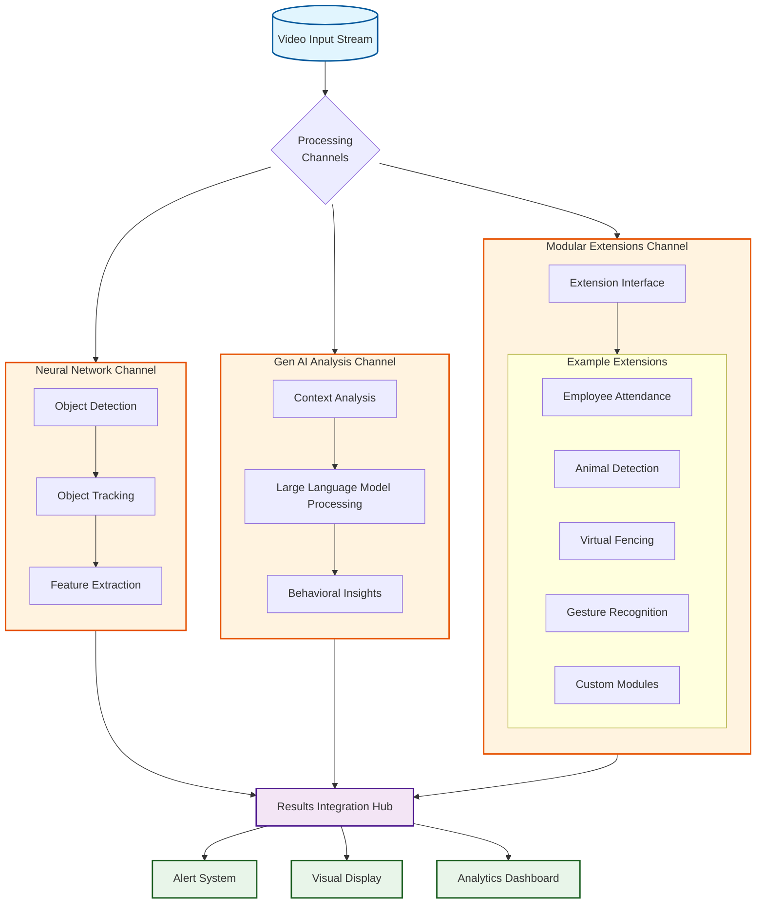

# Guardian Angel: Advanced AI Security System

## Overview
Guardian Angel is a state-of-the-art AI-powered security system that combines neural networks, generative AI, and modular extensions to provide comprehensive surveillance and monitoring capabilities. The system processes video streams in real-time through multiple analysis channels to deliver intelligent security insights and alerts.

## System Architecture

### Core Components




The system is built on three primary channels:

#### 1. Neural Network Channel
- **YOLOv8 Object Detection**: High-performance real-time object detection
- **Object Tracking**: Continuous tracking of detected objects across frames
- **Feature Extraction**: Deep learning-based feature extraction for object classification

#### 2. Gen AI Analysis Channel
- **Context Analysis**: Understanding scene context and object relationships
- **LLM Processing**: Natural language processing for scene interpretation
- **Behavioral Insights**: Advanced pattern recognition for behavior analysis

#### 3. Modular Extensions Channel
Flexible architecture supporting various security applications:
- Employee Attendance
- Animal Detection
- Virtual Fencing
- Gesture Recognition
- Custom Modules

### Key Features

#### Real-time Processing
- Low-latency video stream analysis
- GPU-accelerated neural network inference
- Optimized multi-threading for parallel processing

#### Intelligent Analysis
- Context-aware scene interpretation
- Behavioral pattern recognition
- Anomaly detection
- Natural language insights

#### Extensible Architecture
- Plug-and-play module system
- Custom extension support
- API integration capabilities

## Technical Implementation

### Core Technologies
- **Computer Vision**: OpenCV, YOLOv8
- **Deep Learning**: PyTorch, Ultralytics
- **AI/ML**: Azure OpenAI, Custom Neural Networks
- **Frontend**: React.js
- **Backend**: Python, Flask

### System Requirements
- CUDA-compatible GPU (recommended)
- Python 3.8+
- Node.js 14+
- Modern web browser

### Environment Setup
```bash
# Backend dependencies
pip install -r requirements.txt

# Frontend dependencies
cd frontend
npm install
```

## Usage

### Starting the System
1. Start the backend server:
```bash
python app.py
```

2. Launch the frontend application:
```bash
cd frontend
npm start
```

### Configuration
- Environment variables in `.env` file
- Neural network parameters in `config.json`
- Module settings in respective configuration files

## Security Features

### Data Protection
- Encrypted video streams
- Secure API communications
- Access control and authentication

### Privacy Considerations
- Data anonymization options
- Configurable retention policies
- GDPR-compliant data handling

## Extension Development

### Creating Custom Modules
1. Implement the extension interface
2. Register the module with the system
3. Configure module parameters
4. Deploy and activate

### API Integration
- RESTful API endpoints
- WebSocket support for real-time data
- Authentication mechanisms

## Performance Optimization

### Hardware Utilization
- GPU acceleration
- Multi-threading optimization
- Memory management

### Scaling Considerations
- Load balancing
- Distributed processing
- Resource allocation

## Troubleshooting

### Common Issues
- Video stream connection problems
- GPU memory allocation
- Module initialization errors

### Logging
- System logs in `logs/`
- Performance metrics
- Error tracking

## Support and Maintenance

### Updates
- Regular model updates
- Security patches
- Feature enhancements

### Community
- GitHub repository
- Documentation updates
- Issue tracking

## License
[Specify License]

## Contributors
[List Contributors]

---

*Guardian Angel: Watching Over What Matters Most*
